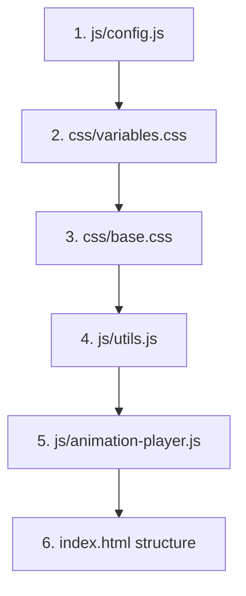

 **The structure is only valuable if you understand the intent behind each file.** Let me give you a clear development roadmap and research plan.

## 🗺️ **Development Starting Point & File Intent**

### **Phase 1: Foundation Files (Start Here)**



#### **File Intent & Starting Order:**

**1. `js/config.js` (START HERE)**

- **Intent**: Single source of truth for all settings
- **Contains**: Animation paths, state definitions, performance settings
- **Why first**: Everything else references these settings

**2. `css/variables.css`**

- **Intent**: CSS custom properties (like config.js but for styling)
- **Contains**: Colors, fonts, spacing, breakpoints
- **Why second**: Defines visual system before building components

**3. `css/base.css`**

- **Intent**: Foundation styles and typography
- **Contains**: Body styles, heading hierarchy, basic layout
- **Why third**: Creates visual foundation

**4. `js/utils.js`**

- **Intent**: Helper functions used across multiple files
- **Contains**: DOM manipulation, number formatting, common operations
- **Why fourth**: Other JS files will depend on these utilities

**5. `js/animation-player.js`**

- **Intent**: Core animation system - plays WebP sequences
- **Contains**: Frame loading, playback control, performance optimization
- **Why fifth**: This is your core technical challenge

### **Phase 2: Core Functionality**

**6. `js/state-machine.js`** - Navigation between states **7. `js/navigation.js`** - UI controls and user interaction **8. `css/state-machine.css`** - Layout for different states

### **Phase 3: Advanced Features**

**9. `js/interactive-elements.js`** - Hover effects, clickable elements **10. `js/force-diagram.js`** - State 3 physics interaction **11. `states/state1.html` → state5.html** - Individual state content

---

## 🔬 **Technical Spike Research Plan**

### **Primary Research Questions for Your AI Agent:**

#### **1. WebP Animation Performance Research**

```
"Research best practices for smooth WebP sequence playback in web browsers:
- Frame preloading strategies for 25fps animation
- Memory management for 100+ frame sequences  
- Browser compatibility and fallback options
- Performance optimization techniques for mobile devices
- Compare WebP vs WebM vs MP4 for this use case"
```

#### **2. State Machine Architecture Patterns**

```
"Research JavaScript state machine patterns for interactive web applications:
- Vanilla JS state management without frameworks
- URL routing for bookmarkable states
- Animation coordination between state transitions
- Memory management for multiple animation sequences
- Best practices for progressive disclosure UI"
```

#### **3. Scientific Web Communication Standards**

```
"Research interactive scientific communication on the web:
- Academic website integration patterns
- Citation and attribution best practices
- Accessibility standards for educational content
- Performance requirements for academic audiences
- Mobile optimization for conference presentations"
```

#### **4. GitHub Pages vs Vercel Deployment**

```
"Compare GitHub Pages vs Vercel for static site deployment:
- Build process differences for vanilla JS projects
- Custom domain and SSL certificate setup
- Performance and CDN capabilities
- Cost implications for academic/open source projects
- Integration with GitHub repositories"
```

#### **5. Animation File Structure Optimization**

```
"Research optimal file organization for web animation assets:
- Directory structure for frame sequences
- Naming conventions for programmatic loading
- Compression techniques for WebP sequences
- Progressive loading strategies
- Cache management for large asset collections"
```

---

## 📋 **Recommended Development Workflow**

### **Week 1: Technical Foundation**

**Day 1-2: Research Phase**

- Run AI agent research on the 5 topics above
- Create `docs/technical-research.md` with findings
- Make technology decisions based on research

**Day 3-4: Core Animation System**

- Build `js/config.js` with your actual settings
- Implement `js/animation-player.js` with your WebP sequences
- Test frame loading and playback

**Day 5-7: Basic State Machine**

- Create simple state switching in `js/state-machine.js`
- Get State 1 → State 2 transition working
- Test with your actual animation files

### **Week 2: Interactive Features**

- Complete all 5 state transitions
- Add interactive force diagram (State 3)
- Mobile responsiveness testing

### **Week 3: Polish & Integration**

- Academic citation integration
- Performance optimization
- Client site integration preparation

---

## 🎯 **Key Technical Decisions to Research:**

### **Animation Strategy:**

- **Preload all frames** vs **lazy load on demand**?
- **Canvas-based playback** vs **DOM image swapping**?
- **Memory pooling** for frame objects?

### **State Management:**

- **Hash-based routing** (#state1, #state2) for bookmarking?
- **History API** for back button support?
- **Animation interruption** handling?

### **Performance Architecture:**

- **Service worker** for aggressive caching?
- **Intersection Observer** for lazy loading?
- **Web Workers** for background processing?

---

## 🔍 **Specific Research Prompts for Your AI Agent:**

```
"I'm building an interactive web platform for scientific communication that uses WebP animation sequences to transition between 5 states. Each transition is 25 frames at 25fps. The target audience is academic researchers who need smooth, professional presentation quality. Research the most effective technical approaches for [specific topic from list above]."
```

**What do you want to research first?** I'd recommend starting with **WebP Animation Performance** since that's your core technical challenge and will inform all other architectural decisions.

Once you have the research results, we can make informed decisions about the implementation approach and update the file structure accordingly!


